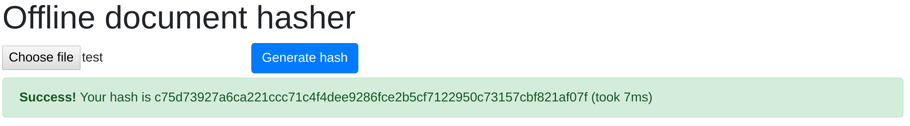

---

This is a demo project to test whether it's viable to hash documents offline in the browser. It takes about ~4x as long as `sha256sum` on my machine.

## Building
```
git clone https://github.com/mvanaltvorst/offline-document-hasher.git
cd offline-document-hasher
npm install
webpack --mode=production
```
The resulting files will be located in the `public/dist/` directory. You can also run `webpack-dev-server` instead of `webpack -mode production` and visit `localhost:8080` if you only plan to use this on your own machine.
